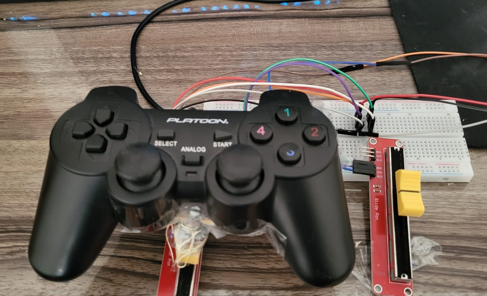
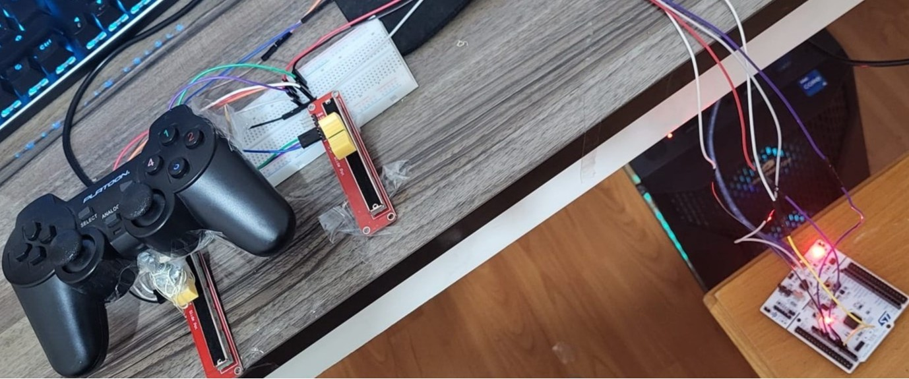
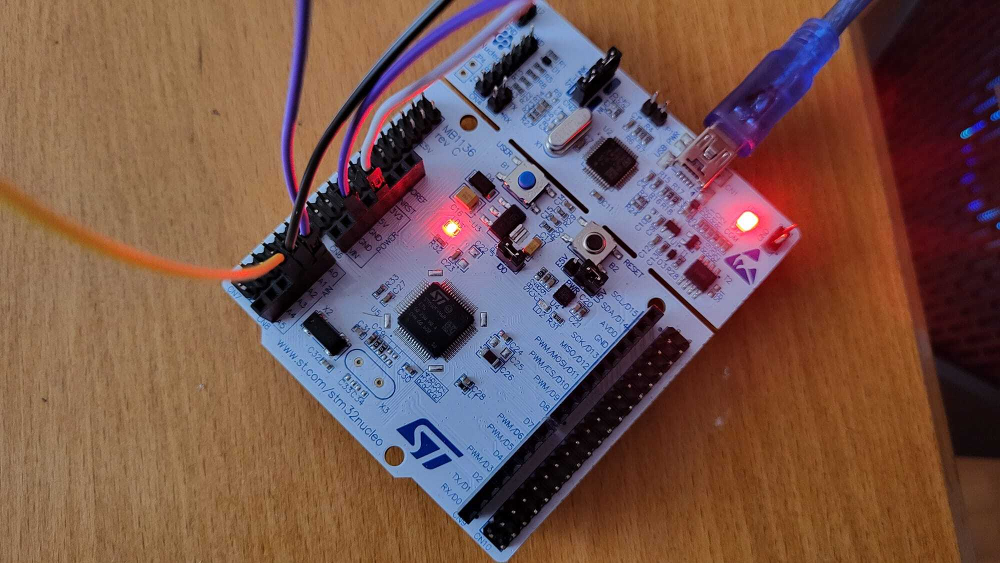

# ✈️ STM32 Tabanlı Özel Uçuş Kontrolcüsü (Custom Flight Controller)

STM32 Nucleo-F446RE geliştirme kartı ve analog potansiyometreler kullanılarak geliştirilmiş, uçuş simülasyonları (War Thunder vb.) için sıfır gecikmeli, 3 eksenli (Roll, Pitch, Throttle) donanım ve yazılım projesidir.

Proje; mikrodenetleyici seviyesinde çok kanallı ADC okuma, DMA mimarisi, gürültü filtreleme algoritmaları, UART seri haberleşme ve Windows işletim sisteminde çalışan bir Python HID/vJoy köprüsünü uçtan uca bir araya getirir.

---

## 🎬 Proje Demosu


---

## 📌 Projenin Amacı ve Özeti

Piyasadaki hazır uçuş kollarının (HOTAS) mekanik ve elektriksel prensiplerini anlamak, gömülü sistem mimarilerini gerçek zamanlı bir simülasyon ortamına bağlamak amacıyla tasarlanmıştır.

Sistem temel olarak şu döngüyle çalışır:
1. Kullanıcının kumanda kolu ve gaz kızağı hareketleri analog voltaj sinyallerine dönüşür.
2. STM32 Nucleo-F446RE kartı bu sinyalleri 12-bit çözünürlükle DMA üzerinden kesintisiz örnekler.
3. Ham veriler yazılımsal hareketli ortalama (moving average) filtresinden geçirilerek titreşimlerden temizlenir.
4. Temizlenen eksen verileri UART üzerinden 115200 baud hızında bilgisayara aktarılır.
5. Python köprü yazılımı bu veriyi karşılar, mekanik açı daralmalarını kalibre eder ve sanal joystick sürücüsüne (vJoy) 15-bit (0–32768) eksen komutu olarak enjekte eder.
6. War Thunder oyunu sistemi standart bir fiziksel USB uçuş kolu olarak tanır.

---
## 📸 Proje Görselleri

<p align="center">
  
  
  
</p>

*Yukarıda sırasıyla: STM32 Nucleo-F446RE breadboard devresi, analog eksen yerleşimi ve oyun içi doğrulama aşamaları.*

## 🛠️ Kullanılan Teknolojiler ve Sistem Mimarisi

* **Mikrodenetleyici:** STM32 Nucleo-F446RE (ARM Cortex-M4 @ 168 MHz)
* **Geliştirme Ortamı:** STM32CubeIDE & STM32CubeMX
* **Gömülü Sürücüler:** STM32 HAL (Hardware Abstraction Layer), DMA, ADC, UART
* **Sinyal İşleme:** 8 örnekli dairesel hareketli ortalama filtresi (Moving Average Filter)
* **Ara Katman / Köprü:** Python 3 (`pyserial`, `pyvjoy`)
* **Sanal Giriş Sürücüsü:** vJoy Device Driver (Virtual Joystick API)
* **Hedef Simülasyon:** War Thunder (Gerçekçi / Tam Gerçekçi Kontroller)

---

## 🔌 Donanım Kurulumu ve Pin Bağlantı Tablosu

Sistemde iki adet döner potansiyometre (Roll ve Pitch için) ve bir adet sürgülü/lineer potansiyometre (Gaz kolu için) kullanılmıştır.

> **Önemli Donanım Notu:** STM32 dahili ADC referansı 3.3V seviyesindedir. Potansiyometrelerin VCC bacaklarına kesinlikle 5V verilmemeli, doğrudan kartın **3V3** pini kullanılmalıdır.

| Eksen / Fonksiyon | Fiziksel Giriş Elemanı | Nucleo Pini | CubeMX Fonksiyonu | Çözünürlük / Aralık |
| :--- | :--- | :--- | :--- | :--- |
| **Roll (Yatış - X)** | Döner Potansiyometre | **PA0 (A0)** | `ADC1_IN0` | 12-bit (1500–2400 ham)* |
| **Pitch (Yunuslama - Y)**| Döner Potansiyometre | **PA1 (A1)** | `ADC1_IN1` | 12-bit (0–4000 ham) |
| **Throttle (Gaz - Z)** | Sürgülü Potansiyometre | **PA4 (A2)** | `ADC1_IN4` | 12-bit (0–4000 ham) |
| **Seri Haberleşme (TX)**| ST-LINK Virtual COM | **PA2** | `USART2_TX` | 115200 Baud, 8N1 |
| **Seri Haberleşme (RX)**| ST-LINK Virtual COM | **PA3** | `USART2_RX` | 115200 Baud, 8N1 |

*\*Roll eksenindeki mekanik kol tasarımı potansiyometrenin tüm dönüş açısını (300°) kullanmadığından, ~60°'lik hareket aralığı yazılımsal olarak tam skalaya genişletilmiştir.*

---

## 🧠 Gömülü Yazılım ve Çalışma Mantığı

### Çok Kanallı ADC ve DMA Yapılandırması
Kart üzerinde CPU'yu meşgul etmeden yüksek hızda örnekleme yapabilmek için **DMA (Doğrudan Bellek Erişimi)** kullanılmıştır:
* **Scan Conversion Mode:** Açık (3 kanal sırayla taranır: Rank 1 -> IN0, Rank 2 -> IN1, Rank 3 -> IN4).
* **Continuous Conversion Mode:** Açık (Örnekleme sürekli tekrarlanır).
* **DMA Settings:** `Circular` mod ve `Half Word` (16-bit veri genişliği) seçilerek veriler doğrudan RAM tamponuna yazılır.

## 🚀 Adım Adım Kurulum ve Çalıştırma Kılavuzu

Sistemi sıfırdan kurup War Thunder üzerinde sorunsuz çalıştırmak için aşağıdaki adımları sırasıyla uygulayın.

---

### 1. Ön Gereksinimler ve Yazılım Kurulumları

Bilgisayar tarafındaki sürücü ve kütüphane altyapısını hazırlayın:

1. **vJoy Sanal Joystick Sürücüsünü Kurun:**
   - [vJoy Resmi Sayfasından (SourceForge)](https://sourceforge.net/projects/vjoystick/) kurulum dosyasını indirin ve kurun.
   - Kurulum tamamlandığında Windows Başlat menüsünden **vJoyConf** uygulamasını aratıp açın.
   - `Device 1` için **Axes** kısmında `X`, `Y` ve `Slider` (veya `SL0`) seçeneklerinin işaretli, buton sayısının en az `8` olduğunu doğrulayıp **Apply** butonuna basın.

2. **Python Kütüphanelerini Yükleyin:**
   - Komut İstemi (CMD) veya PowerShell açıp şu komutu çalıştırın:
     ```bash
     pip install pyserial pyvjoy
     ```

---

### 2. Donanım Bağlantısı ve Pin Yerleşimi

Nucleo kartınızın USB kablosunu henüz bilgisayara takmadan önce devre bağlantılarını breadboard üzerinde kurun:

* **Besleme:** Bütün potansiyometrelerin `VCC` uçlarını Nucleo üzerindeki **3.3V (3V3)** pinine, `GND` uçlarını ise kartın **GND** pinine bağlayın *(Kesinlikle 5V pini kullanmayın, ADC 3.3V referanslıdır)*.
* **Roll Potansiyometresi Sinyal Ucu (Löve Sağa-Sola):** `PA0` (Arduino başlığında **A0**)
* **Pitch Potansiyometresi Sinyal Ucu (Löve İleri-Geri):** `PA1` (Arduino başlığında **A1**)
* **Throttle Sürgülü Potansiyometre Sinyal Ucu (Gaz Kızağı):** `PA4` (Arduino başlığında **A2**)

---

### 3. STM32 Firmware'inin Yüklenmesi

1. **STM32CubeIDE** uygulamasını açın ve projeyi içe aktarın (`File -> Open Projects from File System...`).
2. Nucleo-F446RE kartınızı USB kablosuyla bilgisayara bağlayın.
3. Projeyi derlemek için **`Ctrl + B`** tuşlarına basın. Konsolda `Build Finished. 0 errors, 0 warnings` çıktısını görün.
4. Üst araç çubuğundaki yeşil **Run (Çalıştır)** butonuna basarak kodu karta flaşlayın. Yükleme tamamlandığında kart üzerindeki ST-LINK LED'i yeşile dönecektir.

---

### 4. Seri Port Tespiti ve Python Köprüsünün Başlatılması

1. **COM Portunu Öğrenin:**
   - Klavyeden `Win + X` tuşlarına basıp **Aygıt Yöneticisi**'ni açın.
   - **Bağlantı Noktaları (COM ve LPT)** sekmesini genişletin.
   - `STMicroelectronics STLink Virtual COM Port (COMx)` satırındaki COM numarasını not edin (Örn: `COM4`).

2. **Python Dosyasını Düzenleyin:**
   - `joystick_bridge.py` dosyasını bir metin düzenleyici ile açın ve port değişkenini kendi portunuzla güncelleyin:
     ```python
     COM_PORT = 'COM4'  # Kendi COM port numaranızı yazın
     ```

3. **Köprüyü Çalıştırın:**
   - Terminalden scriptin bulunduğu dizine gidip kodu başlatın:
     ```bash
     python joystick_bridge.py
     ```
   - Ekranda `vJoy cihazı başarıyla bağlandı.` ve `COMx dinleniyor...` yazılarını gördüğünüzde köprü arka planda veri aktarmaya başlamıştır. Bu terminal penceresini **kapatmayın**.

---

### 5. Windows Panelinde Eksenleri Doğrulama

1. Klavyeden **`Win + R`** tuşlarına basın, açılan kutucuğa **`joy.cpl`** yazıp Enter'a basın.
2. Açılan listede **vJoy Device** cihazına tıklayıp **Özellikler (Properties)** butonuna basın.
3. **Eksen Testi:**
   - Lövyeyi sağa/sola ve ileri/geri hareket ettirdiğinizde kutu içindeki artı imlecinin kenarlara kadar akıcı şekilde ulaştığını,
   - Gaz sürgüsünü ileri/geri kaydırdığınızda gösterge çubuğunun %0 ile %100 arasında kesintisiz dolduğunu teyit edin.

---

### 6. War Thunder İçi Eksen Atamaları

1. Oyunu başlatın ve **Seçenekler -> Kontroller -> Uçak** sekmesine gidin.
2. En üstteki kontrol şemasını **Gerçekçi Kontroller (Realistic Controls)** veya **Tam Gerçekçi (Full-Real)** moduna alın.
3. Eksenleri sırayla tanımlayın:
   - **Yatış Ekseni (Roll Axis):** Eksen satırına çift tıklayın $\rightarrow$ Eksen Listesinden `C1:vJoy Device:Eksen 1` seçin $\rightarrow$ *Ölü Bölge: 0.04, Doğrusalsızlık: 2.0*.
   - **Yunuslama Ekseni (Pitch Axis):** Eksen satırına çift tıklayın $\rightarrow$ Eksen Listesinden `C1:vJoy Device:Eksen 2` seçin $\rightarrow$ *Ölü Bölge: 0.04, Doğrusalsızlık: 2.0*.
   - **Gaz Ekseni (Throttle Axis):** Eksen satırına çift tıklayın $\rightarrow$ Eksen Listesinden `C1:vJoy Device:Eksen 7` (veya Eksen 3) seçin $\rightarrow$ *Göreceli Kontrol: Hayır, Ölü Bölge: 0.00*.
4. **Test Uçuşu (Test Flight):** Bir uçak seçip test uçuşuna başlayın; uçağın kumanda yüzeylerinin lövye ve gaz hareketlerinize anlık tepki verdiğini doğrulayın.

## 🤖 Yapay Zeka Destekli Geliştirme Süreci (AI Assistance)

Bu proje, modern bir yapay zeka destekli mühendislik iş akışı (AI Pair Programming) kullanılarak geliştirilmiştir:

- **Gömülü Yazılım ve Donanım Hata Ayıklama:** STM32 tarafında çok kanallı ADC okumaları, DMA Circular mod yapılandırması, 3.3V referans gerilim hattındaki temassızlıkların kök neden analizi ve kanallar arası sinyal etkileşimlerinin (crosstalk) giderilmesinde Gemini'den teknik danışmanlık alınmıştır.
- **Ara Katman (Middleware) & Kalibrasyon:** Python tarafında seri port verisini okuyan ve potansiyometrelerin mekanik açı sınırlarını dinamik olarak 15-bit vJoy sanal eksenlerine yayan `joystick_bridge.py` betiğinin geliştirilmesinde ve optimizasyonunda yapay zekadan yararlanılmıştır.
- **Teknik Dokümantasyon:** Projenin mimari yapısının, bağlantı şemalarının ve teknik README içeriğinin yapılandırılması yapay zeka desteğiyle hazırlanmıştır.

*Tüm devre kurulumu, breadboard pin bağlantıları, donanımsal ölçümler ve simülasyon içi uçuş testleri fiziksel donanım üzerinde bizzat uygulanmış ve doğrulanmıştır.*
